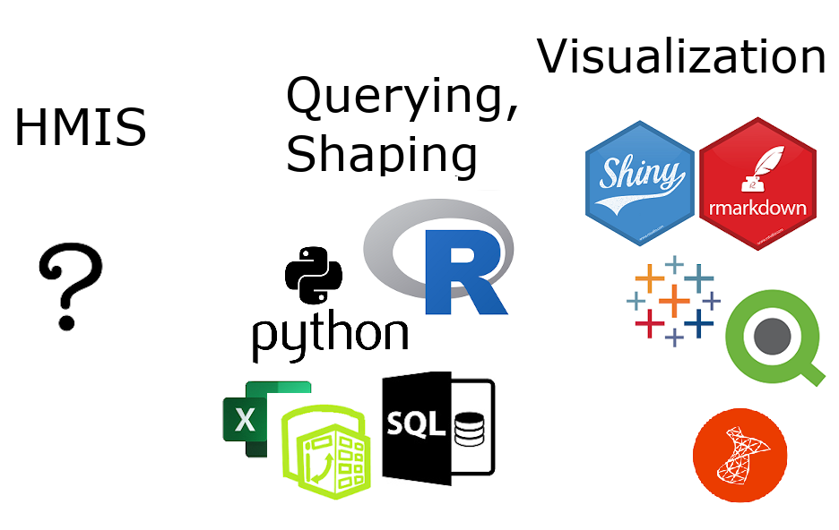
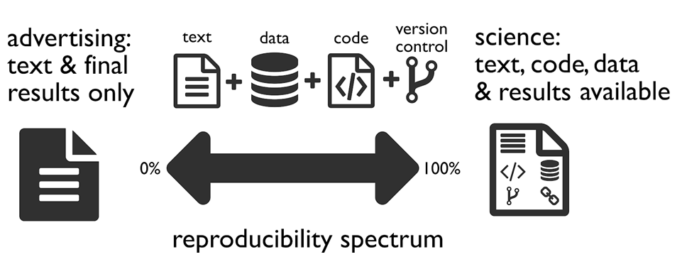
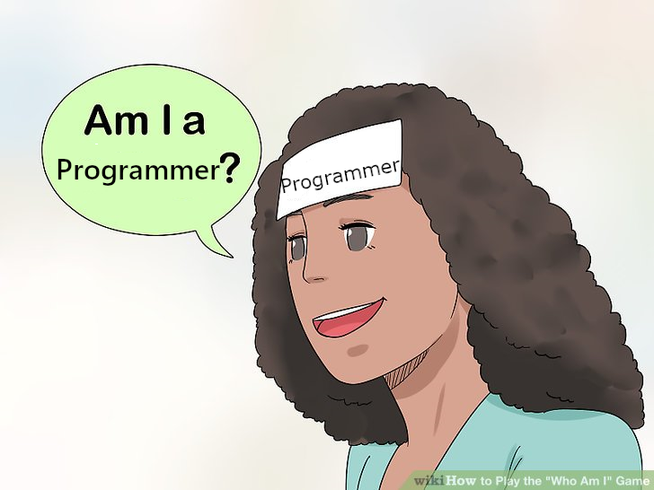
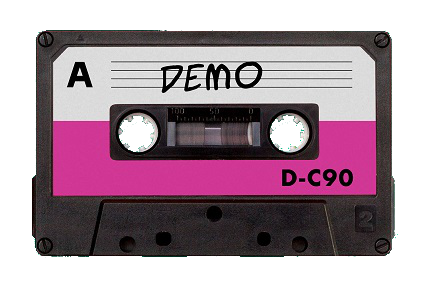
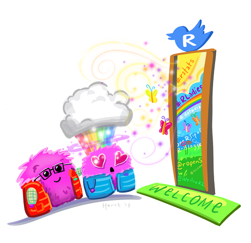

```{r setup, include=FALSE}
library(knitr)
knitr::opts_chunk$set(echo = FALSE)
```

### Intro

**Genelle Denzin** she/hers

Data Analyst

Coalition on Homelessness and Housing in Ohio (COHHIO)

* LSU BA in English Lit. Came to this position from a data background almost 10 years ago. 

* Special thanks to everyone who helped me put this together.

### Agenda

* Workflows for HMIS Data Analysts
* What is Reproducibility?
* Reproducibility With Current Tools
* What is R Markdown?
* How to Get Started with R (if you want)

### Workflows for Data Analysts

 

::: notes
raw data = unfiltered unformatted data straight from your HMIS that you (the data analyst) cannot alter from within the system.
:::
  
### Our workflows are important


### An Example

Analysis on how many DV survivors were served in our CoC's projects during 2018. My theoretical year-ago workflow:

1.  Create custom report named "DV Analysis 2018" in HMIS, export to Excel, name it "Domestic Violence 2018"
2.  Rename columns, remove last row 
3.  Import into visualization software
4.  Create visualization with the results

### The Problem(s)

* Will Future You be able to work back from the visualization to the raw data?
* If the results of your analysis are questioned, can you explain your results without stress or difficulty?
* A well-meaning co-worker repurposes your custom report in HMIS called "DV Analysis 2018", renames it "DV Analysis 2019", and modifies the logic. Could you recreate it?

### What is Reproducibility?



:::notes
talk about it in general, we can't get to 100%
go through the four icons
version control: Word -> Track Changes, Google docs -> versioning, git -> steep learning curve but worth it
:::

### Ways to Achieve Better Reproducibility with Current Tools

* Data from HMIS should be as raw as possible 
* Document your workflow for each visualization
    * file paths, names, and document types
    * every action you do in your intermediary data shaping tool
    * any further actions you take inside your visualization tool
    * if your data from HMIS is custom, document each action you take to create the data export
    
:::notes
The HUD CSV Export specs are great documentation of your data source. Also you can't edit the export from within HMIS (also good!). 
:::

### What is Markdown

* created by John Gruber and Aaron Swartz
* a simplified version of markup languages
* simple intuitive formatting elements
* easily converted to valid HTML and other formats
* a [quick look at the syntax](https://www.markdownguide.org/basic-syntax)

### What is R Markdown

* allows you to include R code in a markdown document (or SQL, or python and others)
* the R code is evaluated in the processing of the markdown file
* results from the code are displayed in the final markdown document
* can handle parameters

### What is R Markdown (continued)

* can be written in any basic text editor
* must be rendered using the R packages called knitr and rmarkdown
* works very well with R Studio 

### What R Markdown Can Create

* HTML, pdf, Word, and PowerPoint documents 
* interactive documents
* slide decks (not PowerPoint)
* websites, articles, and blogs 
* books
* see the [Gallery](https://rmarkdown.rstudio.com/gallery.html)

### How Does R Markdown Get Us to Reproducibility?

* Every step you take in shaping your data and creating the visualization will be contained in your R Markdown document. Your work documents itself!
* Your data manipulation tool = your visualization tool. No need to copy-paste results into final documents and then later wonder where it came from and how it was built.

### A Note about "Coding" and "Programming"

  

:::notes
What does a programmer look like? Can programmers ALSO be good at people?

You are most likely, in SOME way, already programming. It might look  different, but all the concepts are there. You know your data. You know how you want to see it. 
:::

### Let's Create an Analysis in R Markdown



:::notes
should be about 15 minutes. the plan is to open a fresh .Rmd file in R Studio, point out the structure of it, run it, make some quick edits to make it look better, rerun to see changes.
:::

### Why Move Toward a Reproducible Workflow?

* Easier to find and correct errors
* Helps you create comparison data later
* Helps others to check your logic, which helps validate your work
* Whether or not our data is ever questioned, we should always be prepared to back up our numbers. 

:::notes
(We should welcome this kind of interest and be prepared to respond with integrity.)
:::

### The R Community



### Disclaimer

  * I work in a supportive workplace.
  * I am part of a 3 1/2 person HMIS team.

### To Get Started in R

My three favorite ways:

  * Get [R for Data Science](https://r4ds.had.co.nz/) or access it for free online here: https://r4ds.had.co.nz/
  * Use the R package called [Swirl](https://swirlstats.com/) by going here: https://swirlstats.com/students.html (also free)
  * R-Ladies meetups
  
### We Can Work Together

* Most of my code is available on GitHub: https://github.com/kiadso You are welcome to use it to manipulate your own HMIS data (within the terms).

* These slides and more resources are available there as well: https://github.com/kiadso/rmarkdown_talk

### Questions?


### Contact Info

Genelle Denzin *(she/hers)*

HMIS Data Analyst

Coalition on Homelessness and Housing in Ohio (COHHIO)

genelledenzin@cohhio.org

Twitter: @gh_firefly

GitHub: kiadso